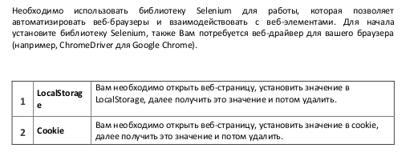

# Condition


# Selenium Firefox Automation

This project demonstrates how to use Selenium with Firefox for web automation tasks, including working with LocalStorage and cookies.

# What the Script Does

* Opens the specified web page.
* Sets, retrieves, and removes a value in LocalStorage.
* Sets, retrieves, and removes a cookie.

## Prerequisites

Ensure you have the following software installed on your system:

- Python 3.10+
- Firefox (installed via Snap)
- Geckodriver (included with the Firefox Snap installation)

## Installation

1. **Clone the repository:**

   ```bash
    git clone https://github.com/yourusername/selenium-firefox-automation.git
    cd selenium-firefox-automation
    
2. **Create a virtual environment and activate it:**

    ```bash
    python3 -m venv venv

    On Ubuntu:
    source venv/bin/activate  
   
    On Windows: 
    use `venv\Scripts\activate` 

    Install the required Python packages:

    pip install -r requirements.txt

3. **Usage**:

    Running the Script
    
    Ensure the correct paths are set for geckodriver and firefox binaries:
    
    The script uses the default installation path for Firefox installed via Snap. Ensure that the paths are correctly set in the script:
    
        install_dir = "/snap/firefox/current/usr/lib/firefox"
        driver_loc = os.path.join(install_dir, "geckodriver")
        binary_loc = os.path.join(install_dir, "firefox")
    
    Run the script:
    
        python main.py
